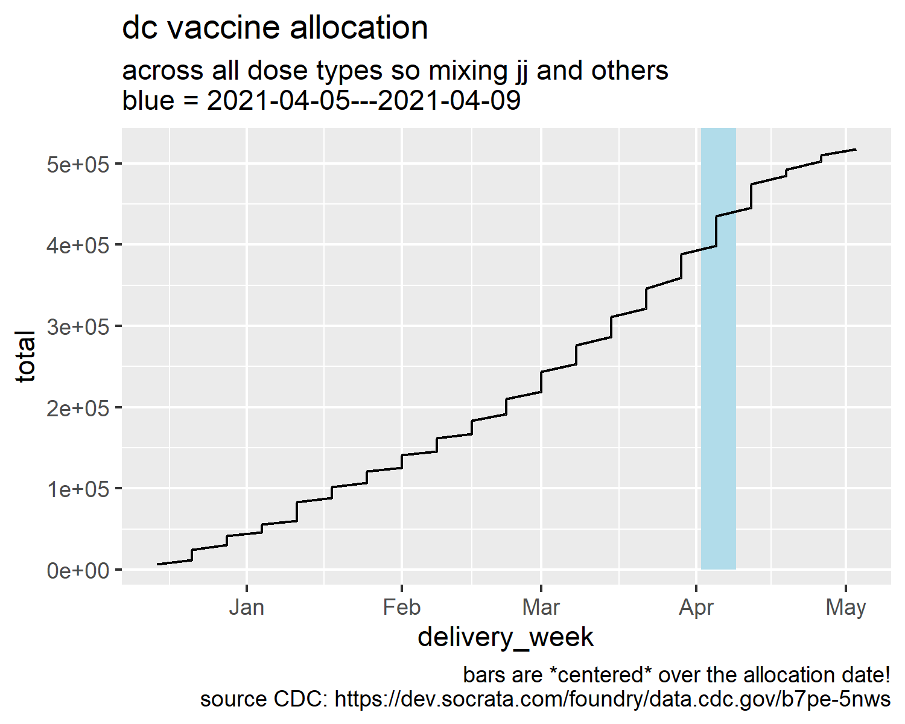

Data pulled from cdc api: https://dev.socrata.com/foundry/data.cdc.gov/b7pe-5nws

>New weekly allocations of doses are posted every Tuesday.  Beginning the following Thursday, states can begin ordering doses from that week’s new allocation of 1st doses.  Beginning two weeks (Pfizer) or three weeks (Moderna) from the following Sunday, states can begin ordering doses from that week’s new allocation of 2nd doses. After doses are ordered by states, shipments begin the following Monday.  The entire order may not arrive in one shipment or on one day, but over the course of the week.  Second doses are opened up for orders on Sundays, at the appropriate interval two or three weeks later according to the manufacturer’s label, with shipments occurring after jurisdictions place orders.  Shipments of an FDA-authorized safe and effective COVID-19 vaccine continue to arrive at sites across America.  Vaccinations began on December 14, 2020. https://www.hhs.gov/coronavirus/covid-19-vaccines/index.html Pfizer Vaccine Data -https://data.cdc.gov/Vaccinations/COVID-19-Vaccine-Initial-Allocations-Pfizer/saz5-9hgg Janssen Vaccine Data -https://data.cdc.gov/Vaccinations/COVID-19-Vaccine-Distribution-Allocations-by-Juris/w9zu-fywh

This data is processed to reflect the lags to when orders for second doses are possible.

Three outputs are compiled with column `delivery_week` the Monday after which shipments could begin if allocated doses were ordered:

- [all the processed data](/all_allocations.csv)
- [the data for the most recent week](/this_week.csv) which **May not be up to date; last update 3/19**
- [the data summarized by week](/weekly_allocations.csv) this gives the total possible deliverys for each week

## Total allocation visualized

